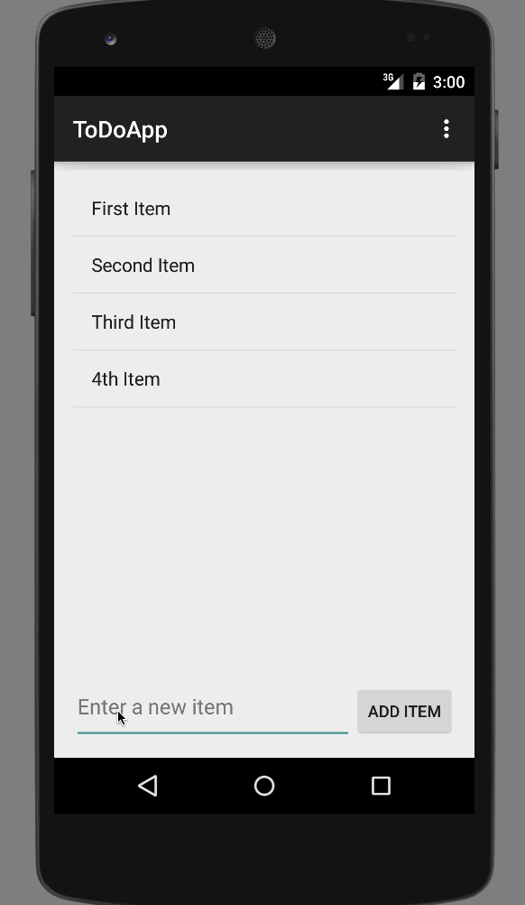

# AndroidAppDemo

(TODO App README)

This is an Android application for maintaining a todo list of items. 

Time spent: 5 hours spent in total

Completed user stories:

 * [x] Required: User can view a list of TODO items added.
 * [x] Required: User can add any TODO item.
 * [x] Required: User can edit TODO item already added by double clicking on the item.
 * [x] Required: User can delete any TODO item by a long press. 
 
Notes:

GIF created with [LiceCap](http://www.cockos.com/licecap/).
